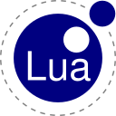

<strong> Hey there! I'm Ryder, a 25yr old full-time mechanic hoping to pursue a new career/dream in development!  Thanks for stopping by my GitHub! </strong>

## Languages & Technologies:

  
  
  
  

## Currently Learning:

  
  
  
  
  

## Future Learning Endeavors:

  
  
  

<!--
**ryderleedev/ryderleedev** is a ✨ _special_ ✨ repository because its `README.md` (this file) appears on your GitHub profile.

Here are some ideas to get you started:

- 🔭 I’m currently working on ...
- 🌱 I’m currently learning ...
- 👯 I’m looking to collaborate on ...
- 🤔 I’m looking for help with ...
- 💬 Ask me about ...
- 📫 How to reach me: ...
- 😄 Pronouns: ...
- ⚡ Fun fact: ...
-->
